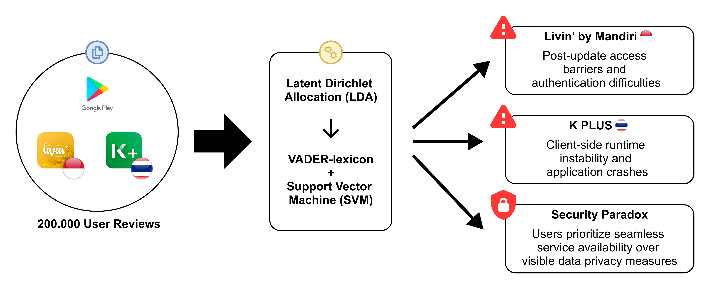

# Comparative Analysis of Technostress Factors in Mobile Banking Reviews Using Aspect-Based Sentiment Analysis and Topic Modeling

This repository contains the source code for my undergraduate thesis, which analyzes user reviews of **Livin' by Mandiri (Indonesia)** and **K PLUS (Thailand)** to identify the factors that contribute to **technostress** in mobile banking applications.

The study combines **Aspect-Based Sentiment Analysis (ABSA)** and **Latent Dirichlet Allocation (LDA)** to extract user sentiments, identify service aspects, and discover the underlying topics that trigger negative user experiences.

---

## Research Objectives

The objectives of this research are:

- Compare user sentiment toward mobile banking services in Indonesia and Thailand.
- Identify the service aspects that receive positive and negative feedback.
- Discover the underlying factors that contribute to technostress.
- Compare technostress characteristics between the two countries.

---

## Dataset

The datasets consist of Google Play Store reviews from:

- **Livin' by Mandiri** (Indonesia)
- **K PLUS** (Thailand)

The reviews were collected using Google Play Store scraping and subsequently translated into English before analysis.

---

## Main Findings

The research produced several important findings:

- **Usability** is the aspect with the highest positive sentiment in both applications.
- **Livin' by Mandiri** users mainly experience technostress due to **access-related issues**, such as login failures and authentication problems.
- **K PLUS** users experience technostress caused by both **system stability** and **access issues**, including crashes, application errors, and slow performance.
- Security and privacy were **not identified as the primary sources of technostress**, suggesting that users prioritize application availability and stability over security mechanisms unless they directly interfere with usability.

---